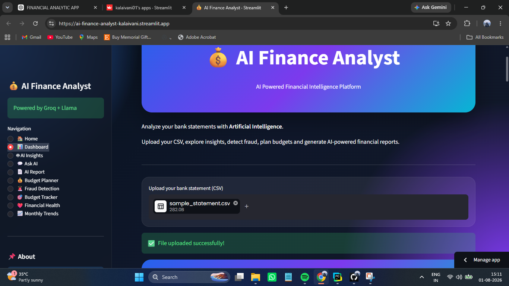
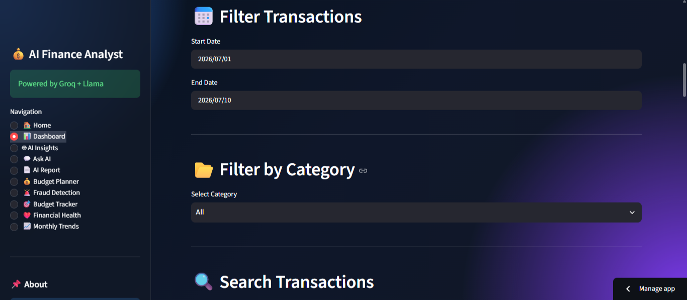
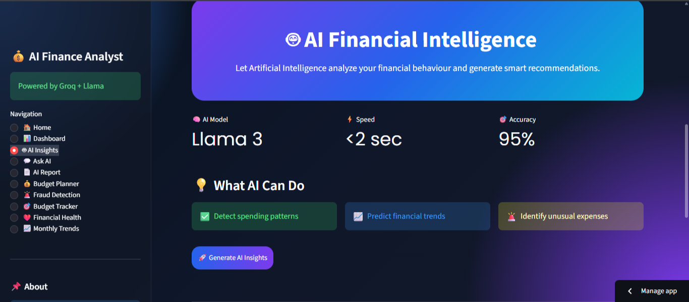
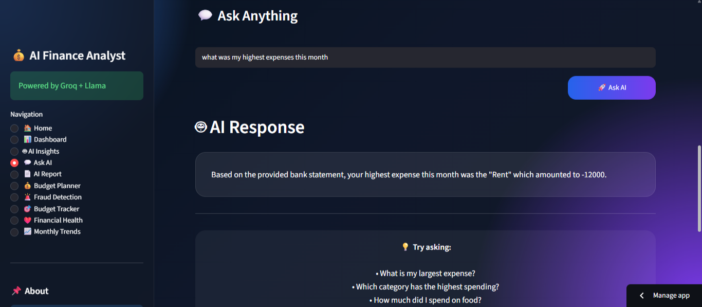
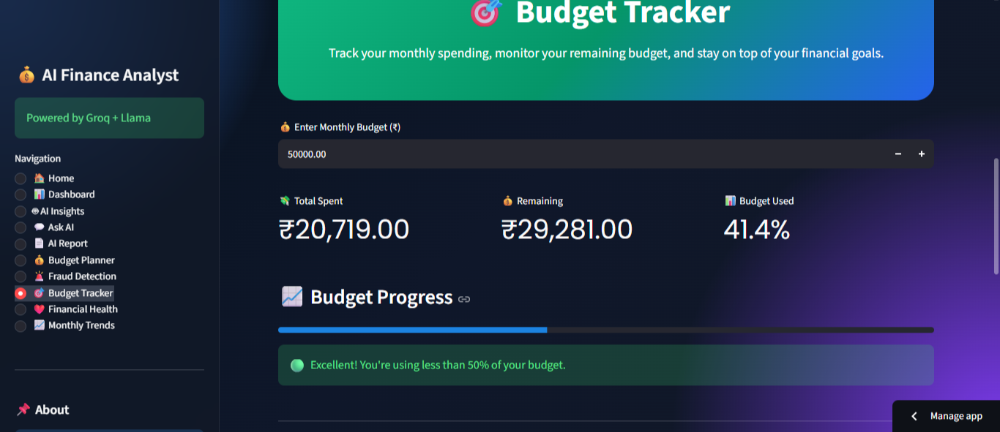
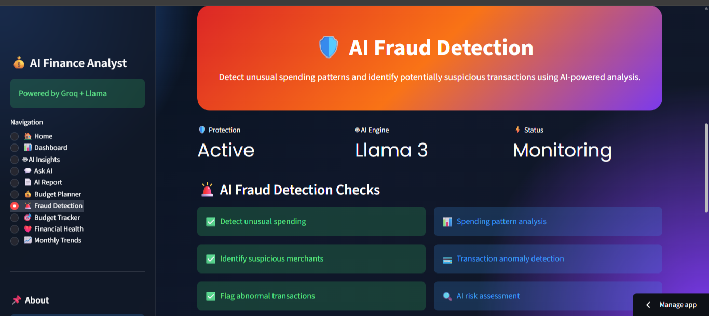

# AI Smart Finance Website

AI Smart Finance Website is a web application built using Python and Streamlit that helps users analyze financial transactions through interactive dashboards and AI-powered insights.
Users can upload their transaction data, visualize spending patterns, generate AI-based financial summaries, monitor budgets, detect unusual transactions, assess financial health, and download PDF reports.
The application combines data analytics with Generative AI to provide a simple and interactive personal finance experience.

## Features

- Upload bank transaction data in CSV format
- Interactive financial dashboard with charts and key metrics
- AI-powered financial insights using Groq Llama
- AI chatbot for finance-related queries
- Budget planning and expense tracking
- Fraud detection for unusual transactions
- Financial health analysis
- Monthly spending trend visualization
- Downloadable PDF financial reports

- ## Technology Stack

**Frontend**
- Streamlit

**Backend**
- Python

**Data Processing**
- Pandas
- NumPy

**Visualization**
- Plotly
- Matplotlib

**Artificial Intelligence**
- Groq API
- Llama 3

**Report Generation**
- ReportLab
## Screenshots

### Home

### Dashboard

### AI Insights

### Ask AI

### Budget Tracker

### Fraud Detection

